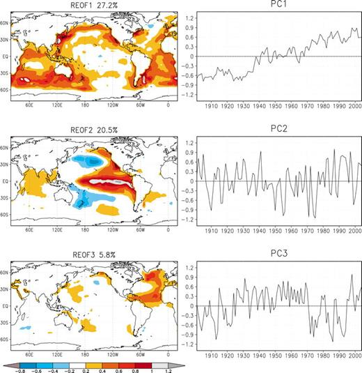

We will explore this using a set of experiments designed to answer the question of how SSTs in different ocean basins impact drought over the continental US.

### History

In 2006, a group of scientists got together to understand predictability of drought because it has such a big societal impact.
Each of them had the ability to perform experiments with a different atmosphere model. 
They put together a set of experiments and each performed the experiment with their own model and they compared the results in the [Drought Working Group Paper](https://journals-ametsoc-org.mutex.gmu.edu/jcli/article/22/19/5251/32333)

### The Scientific Question

What is the role of the different ocean basins, including the impact of El Nino–Southern Oscillation (ENSO), the Pacific decadal oscillation (PDO), the Atlantic multidecadal oscillation (AMO), and warming trends in the global oceans in maintining drought from one year to the next?

### The Experiments

SST anomalies were defined in the Atlantic and Pacific Oceans based on spatial patterns of annual mean SSTs from 1901-2004 determinedd by rotated EOFS..

from [Schubert et al. Figure 1](https://journals-ametsoc-org.mutex.gmu.edu/jcli/article/22/19/5251/32333)

The first EOF is consistent with the global mean trend.

The second EOF is concentrated in the Pacific.

The third EOF is concentrated in the Atlantic.

SST anomaly patterns for the Atlantic and Pacific were created based on this analysis. We will look at them later.

A set of 9 experiments consisting of +/- 2 standard deviations in the Atl and Pacific basins and their combinations created 9 base experiments.

|                 | Warm Atlantic | Neutral Atlantic | Cold Atlantic |
|--------------------------------------------------------------------|
| Warm Pacific    | PwAw          | PwAn             |  PwAc         |
| Neutral Pacific | PnAw          | PnAn             |  PnAc         |
| Cold Pacific    | PcAw          | PcAn             |  PcAc         |

They ran the experiments for 50 years and looked at the impact of each combination of SSTs on precipitation anomalies over the continentatl US. 

We will reproduce (partially) these experiments as a test of how to setup SST forcing experiments in CESM and evaluate our results.

